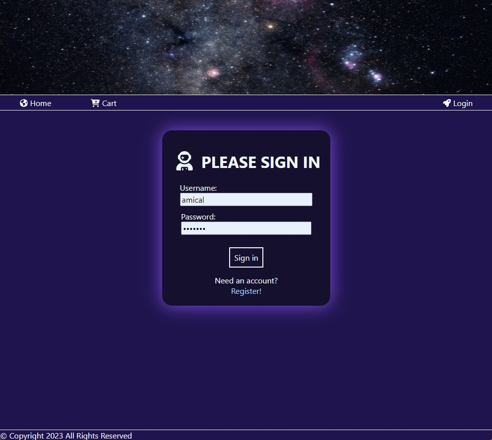

Cosmic-Box-Online-Shopping

A full-stack online retail store project. Includes user login, product listings, product details, cart, and wishlists.

## Table of contents

- [Overview](#overview)
  - [Screenshot](#screenshot)
  - [Links](#links)
- [My process](#my-process)
  - [Built with](#built-with)
  - [Continued development](#continued-development)
- [Author](#author)

## Overview

### Screenshot

### Links

- Solution URL: [GitHub Project Page](https://github.com/micamash/cosmic-box)
- Live Site URL: [Cosmic Box]()

### Built with

* HTML semantic elements
* CSS
* DOM manipulation
* Event handling and listeners
* API
* Vue components and routers

### Continued development

My next step is finishing the "Add to Wishlist" buttons and the wishlists page.

## Author

- Website - [My GitHub](https://github.com/micamash)
